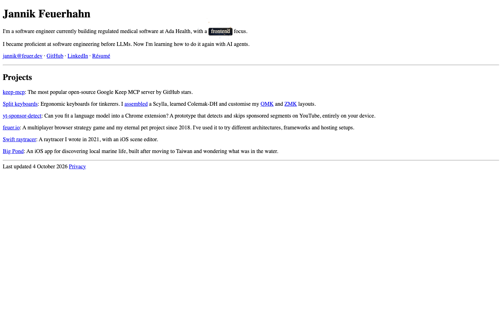
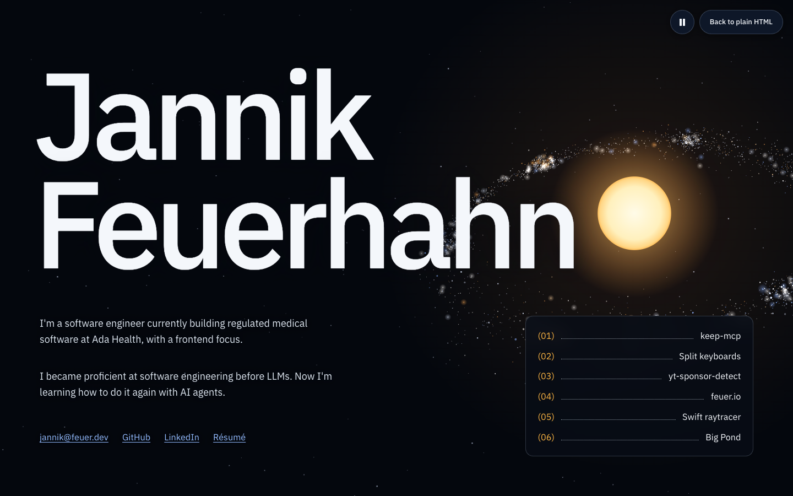
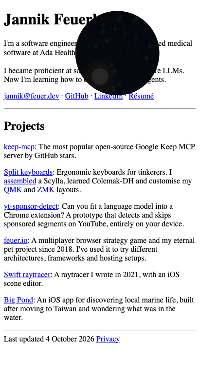

# Inline frontend release checks

Checked on 4 October 2026 at `http://127.0.0.1:5002/`.

- TypeScript build and all four document tests passed.
- All 12 browser check scripts passed: entry/reveal, scroll, occlusion, images,
  pointer, mobile rendering, mobile viewport, title, Safari scroll smoothing,
  Android scroll timing, universe backdrop and anchor navigation.
- Fresh loads, refreshes and legacy `?mode=fancy` URLs start plain. Other query
  parameters and fragments survive. Switching does not add a mode parameter.
- Desktop and narrow layouts were inspected. The mobile mask keeps advancing
  when the viewport height changes and leaves no temporary layer after switching.
- Both font faces load before capture. Formation starts during the reveal.
  Failed fonts, skipped native capture, offline asset recovery and an unavailable
  entry script retain readable content.
- Repeated switches retain keyboard focus and project position without
  duplicating images. Pause and reduced motion stop decorative movement.
- The clean visual preview had no console messages or page errors. All observed
  local resource requests returned 200. Plain startup loads only the document,
  base CSS, entry script, small teaser, palette and favicon.
- Jannik confirmed the final radial-mask reveal works on his Google Pixel 8.
  Desktop emulation did not reproduce the earlier viewport-capture cancellation
  or the subsequent invisible compound clip-path animation. Safari wheel and
  Android scroll timing checks emulate those environments in Chromium.

The screenshots below are local Chromium captures, not physical phone captures.

